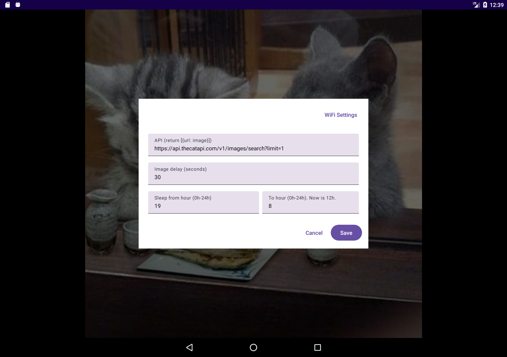

WhatTheFoto
===========

Display images in Android photo frame by calling the API.

Support Android 6.0+.

Sample API: https://api.thecatapi.com/v1/images/search?limit=10

Should work with: [Whatthehive](https://github.com/manhtai/whatthehive)

## Demo

---

&copy; 2024 Tai Vo
